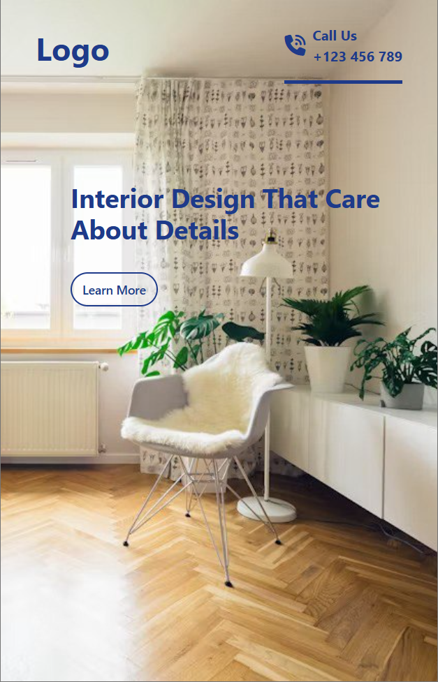

# **A simple responsive interior designing website** built with **HTML** and **Tailwind CSS** can showcase modern and elegant design solutions. The website includes the following:

- **Home Page**: A visually appealing landing section with a hero image and a catchy tagline.
- **About Us**: A brief description of the company, mission, and team.
- **Benefits**: A responsive gallery displaying previous projects with hover effects.
- **Projects**: A responsive gallery displaying previous projects with hover effects.
- **Stages**: A simple, responsive form for inquiries, with clean input fields and a submit button.
- **Contact Bar**: A simple, responsive form for inquiries, with clean input fields and a submit button.

---

## Sample Screen

- full screen
  

- mobile screen
  
